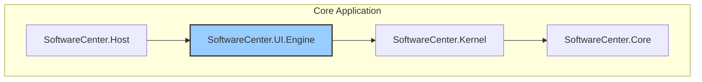

# Project: SoftwareCenter.UI.Engine

## Overview

The `SoftwareCenter.UI.Engine` is a mandatory, core component of the SoftwareCenter ecosystem, acting as a "UI Kernel." It is responsible for dynamically composing, rendering, and managing the entire application user interface. It operates on a strict request-response model, where no part of the system (including the Host or other Modules) can directly manipulate the UI. Instead, they send formal requests (Commands) to the UI.Engine, which then validates them, updates its internal UI state, and pushes the changes to the web-based frontend.

This architecture ensures a centralized, secure, and consistent approach to UI management, allowing for advanced features like shared ownership of UI components, runtime UI updates, and a decoupled design where modules do not need to know about the underlying UI technology.

## Core Responsibilities

- **UI State Management:** Maintains the single source of truth for the entire UI component tree in memory.
- **Command-Driven UI Composition:** Processes requests from the Host and Modules to add, remove, or update UI elements.
- **Real-time Frontend Synchronization:** Uses a WebSocket (SignalR) connection to push UI changes to the browser client in real-time.
- **Rendering Modes:** Supports multiple rendering strategies, including simple control arrays, card-based layouts, and the injection of custom HTML/CSS/JS.
- **Ownership and Permissions:** Enforces a granular security model that dictates which module or service can interact with or modify specific UI components.

## Project Dependencies

